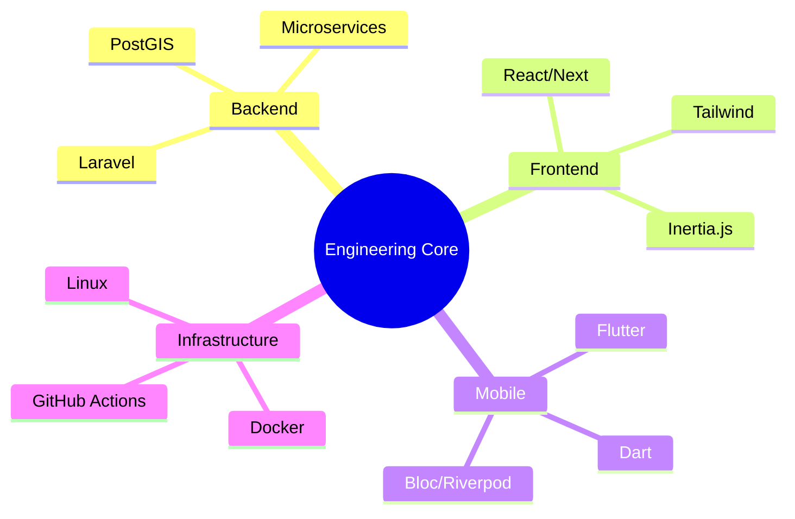

<div align="center">
  
  <!-- Neon Neon Header Banner -->
  
  
  <!-- Glowing Matrix Typing Animation -->
  <a href="https://git.io/typing-svg">
    
  </a>
  
</div>

<div align="center" style="margin-top: 25px;">
  <a href="https://github.com/mahederegezahegn">
    
  </a>
  <a href="mailto:mahederegezaheng@gmail.com">
    
  </a>
  <a href="https://linkedin.com/in/mahederegezahegn">
    
  </a>
</div>

---

## ⚡ System Status: Professional Overview

```json
{
  "role": "Senior Full Stack Engineer",
  "location": "Addis Ababa, Ethiopia 🇪🇹",
  "experience": "3+ Years of High-Intensity Engineering",
  "specialization": ["Backend Architecture", "Responsive UI", "Mobile Solutions"],
  "philosophy": "Simplicity is the ultimate sophistication."
}
```

I specialize in constructing robust, scalable digital ecosystems. My methodology bridges the gap between complex **Laravel** backend logic and fluid **React/Flutter** interfaces, ensuring a seamless user experience across all touchpoints.

---

## 🛠️ The Tech Forge

<div align="center">
  <table style="border: 2px solid #00dc82; border-radius: 15px; border-collapse: separate; padding: 10px; background-color: #0d1117; color: #00dc82; box-shadow: 0 0 15px #00dc82;">
    <tr>
      <th align="center"><b>Backend Mastery</b></th>
      <th align="center"><b>Frontend Alchemy</b></th>
      <th align="center"><b>Mobile & Cloud</b></th>
    </tr>
    <tr>
      <td align="center">
        
      </td>
      <td align="center">
        
      </td>
      <td align="center">
        
      </td>
    </tr>
  </table>
</div>

<br/>

<div align="center">
  
  ### 🧬 Core Competencies
  | Skill | Level | Mastery |
  | :--- | :---: | :--- |
  | **Laravel Architecture** | `██████████` | 98% |
  | **React & Inertia** | `█████████░` | 92% |
  | **Flutter State Management** | `█████████░` | 90% |
  | **Database Performance** | `████████░░` | 85% |
  | **Spatial Engineering** | `████████░░` | 82% |

</div>

---

## 🏆 GitHub Achievement Trophy Room

<div align="center">
  
</div>

---

## 💎 Project Showcases

<details open>
<summary><b>📍 LocalLens: Geo-Discovery Flagship</b></summary>
<br/>
<blockquote>
<b>Description:</b> A community-powered spatial engine for hyper-local exploration. Real spots, real people, zero algorithm bias.
<br/><br/>
<b>Features:</b> Interactive Geospatial Leaflet Map · Real-time Post Sync · PostGIS Spatial Queries · High-Performance Image Optimization
<br/><br/>
<b>Tech Stack:</b> Laravel Core · React Desktop · PostGIS · Leaflet · Redis
</blockquote>
</details>

<details>
<summary><b>💼 Enterprise Solutions Portfolio</b></summary>
<br/>
- **Dental Clinic Management**: Comprehensive medical records & real-time scheduling system.
- **KPI Performance Scorecard**: High-precision evaluation tool for organizational growth.
- **CRM Pipeline Optimizer**: End-to-end sales lifecycle and contact management engine.
</details>

---

## 📊 Analytics Deep Dive

<div align="center">
  
  
</div>

<div align="center">
  
  
</div>

### 🐍 Contribution Vector (Daily Update)
<p align="center">
  
</p>

---

## 🔭 Developer Roadmap & Mindset

<div align="center">



</div>

---

## 🎯 Engineering Methodology

> [!TIP]
> ### 🟢 Clean Code Strategy
> - **DRY & KISS**: Don't Repeat Yourself & Keep It Simple, Stupid.
> - **Test Driven**: If it's not tested, it's broken by design.
> - **Performance Oriented**: Latency is the enemy of UX.

---

## 📬 Open Socket & Connect

<div align="center">
  <p>Status: <b>Ready for high-impact collaborations.</b></p>
  
  <a href="mailto:mahederegezaheng@gmail.com">
    
  </a>
  &nbsp;&nbsp;
  <a href="https://linkedin.com/in/mahederegezahegn">
    
  </a>
</div>

<br/>

<div align="center">
  
  <sub><b>&copy; 2025 MAHEDERE GEZAHENG</b> | All Systems Operational</sub>
</div>
