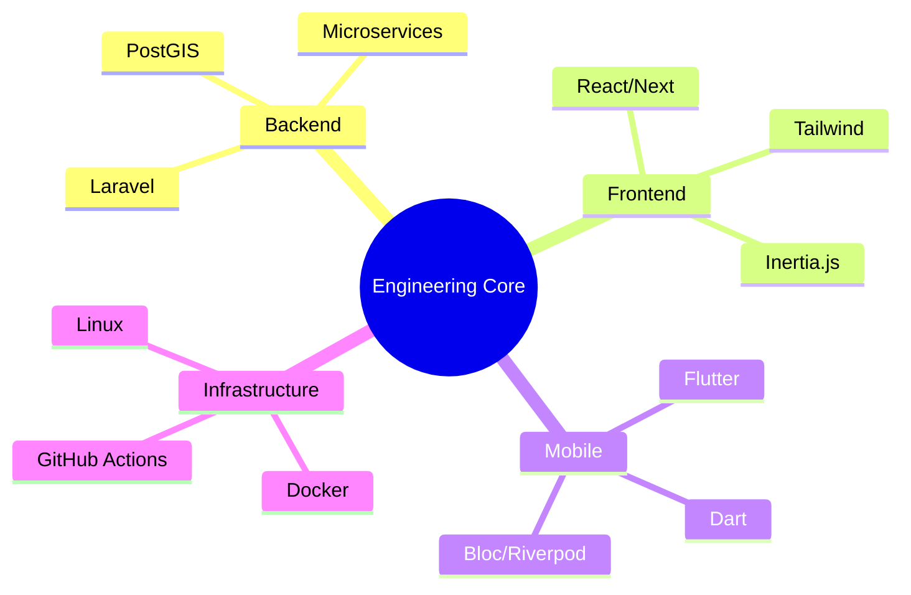

<div align="center">
  
  <!-- Neon Neon Header Banner -->
  
  
  <!-- Glowing Matrix Typing Animation -->
  <a href="https://git.io/typing-svg">
    
  </a>
  
</div>

<div align="center" style="margin-top: 25px;">
  <a href="https://github.com/mahederegezahegn">
    
  </a>
  <a href="mailto:mahederegezaheng@gmail.com">
    
  </a>
  <a href="https://linkedin.com/in/mahederegezahegn">
    
  </a>
</div>

---

## ⚡ Engineering Console: Professional Instance

```json
{
  "engineer": "Mahedere Gezaheng",
  "location": "Addis Ababa, Ethiopia 🇪🇹",
  "tenure": "3+ productive years",
  "specialties": {
    "backend": ["Laravel", "PostGIS", "Redis"],
    "frontend": ["React", "Next.js", "Tailwind"],
    "mobile": ["Flutter", "Dart", "Firebase"]
  },
  "uptime": "99.9% dedicated to code quality"
}
```

I architect high-performance digital environments. My core philosophy is that code should be as **elegant** as it is **functional**. By bridging complex business logic with seamless user interfaces, I deliver solutions that scale and survive the real world.

---

## 🛠️ The Tech Forge

<div align="center">
  <table style="border: 2px solid #00dc82; border-radius: 15px; border-collapse: separate; padding: 10px; background-color: #0d1117; color: #00dc82; box-shadow: 0 0 20px #00dc8280;">
    <tr>
      <th align="center"><b>Backend Mastery</b></th>
      <th align="center"><b>Frontend Alchemy</b></th>
      <th align="center"><b>Mobile & Cloud</b></th>
    </tr>
    <tr>
      <td align="center">
        
      </td>
      <td align="center">
        
      </td>
      <td align="center">
        
      </td>
    </tr>
  </table>
</div>

<br/>

<div align="center">
  
  ### 🧬 Core System Metrics
  | Proficiency Level | Gauge |
  | :--- | :--- |
  | **Laravel Ecosystem** | `██████████████████████████████ 98%` |
  | **React & Component Architecture** | `████████████████████████████░░ 92%` |
  | **Flutter State Management** | `███████████████████████████░░░ 90%` |
  | **Database Scalability** | `██████████████████████████░░░░ 86%` |
  | **Geospatial Engineering** | `█████████████████████████░░░░░ 82%` |

</div>

---

## 🧊 GitHub Contributions 3D Rendering
<!-- Note: This image will load once the GitHub Action has successfully run -->
<p align="center">
  
</p>

---

## 🏆 GitHub Achievement Trophy Room

<div align="center">
  
</div>

---

## 💎 Mission Showcases

<details open>
<summary><b>📍 LocalLens: Community Geo-Discovery (Lead)</b></summary>
<br/>
<blockquote>
<b>Intelligence:</b> A multi-tenant spatial engine optimized for hyper-local post discovery.
<br/><br/>
<b>Protocols:</b> Interactive Leaflet Maps · PostGIS Proximity Queries · High-Concurrency Data Syncing
<br/><br/>
<b>Stack:</b> Laravel Enterprise · React/Next · PostGIS · Leaflet · Redis Cluster
</blockquote>
</details>

<details>
<summary><b>💼 Commercial & Enterprise Deployments</b></summary>
<br/>
- **Dental Management System**: Electronic Medical Records (EMR) & Scheduling Logic.
- **KPI Performance Scorecard**: High-precision evaluation matrix for staff optimization.
- **CRM Pipeline Engine**: Complete lead-to-conversion lifecycle management.
</details>

---

## 📊 Analytics Deep Dive

<div align="center">
  
  
</div>

<div align="center">
  
  
</div>

### 🐍 Contribution Vector (Daily Update)
<p align="center">
  
</p>

---

## 🔭 Developer Strategic Mindmap

<div align="center">



</div>

---

## 🎯 High-Performance Principles

> [!IMPORTANT]
> ### 🟢 Operational Strategy
> - **Code Aesthetics**: If it's ugly, it's inefficient.
> - **Zero-Latency Design**: User experience is directly tied to performance.
> - **Atomic Engineering**: Small, independent components for massive scale.

---

## 📬 Establish Secure Link

<div align="center">
  <p>Status: <b>Ready for high-impact technical partnerships.</b></p>
  
  <a href="mailto:mahederegezaheng@gmail.com">
    
  </a>
  &nbsp;&nbsp;
  <a href="https://linkedin.com/in/mahederegezahegn">
    
  </a>
</div>

<br/>

<div align="center">
  
  <sub><b>&copy; 2025 MAHEDERE GEZAHENG</b> | SYSTEM_ALL_GREEN</sub>
</div>
