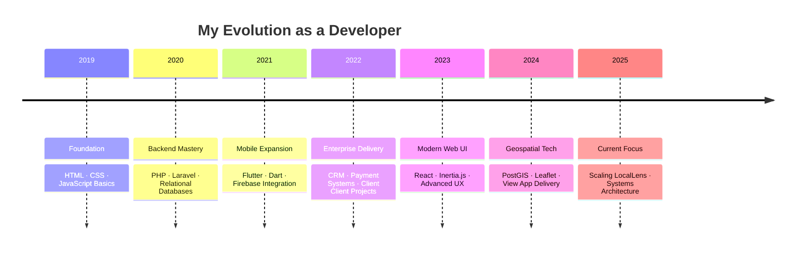

  
  <!-- Premium Header Banner -->
  
  
  <!-- Dynamic Typing Animation -->
  
  
  <!-- Essential Profile Metrics -->
  

    
    
    
    
  

  

---

## 🏛️ Professional Overview

**Senior Full Stack Engineer** based in **Addis Ababa, Ethiopia** 🇪🇹. With over **6 years** of intensive application building, I specialize in bridging the gap between complex backend architectures and intuitive, high-performance user interfaces.

My philosophy centers on **Clean Code**, **User-Centric Design**, and **Pragmatic Scalability**. I don't just write code; I build solutions that solve real-world problems.

### 🔭 Current Ventures
- 🚀 **Lead Architect** at **LocalLens** — Redefining community geo-discovery.
- ⚡ Optimizing high-performance Flutter rendering and state management.
- 🗺️ Advanced geospatial engineering with PostGIS and interactive mapping.

---

## ⚒️ Technical Arsenal

  
   
  

 

| Domain | Proficiency | Core Technologies |
| :--- | :---: | :--- |
| **Backend & Architecture** | `92%` | PHP / Laravel, RESTful APIs, Microservices, MySQL, PostgreSQL (PostGIS) |
| **Frontend & Web SPA** | `88%` | React.js, Inertia.js, Alpine.js, TailwindCSS, TypeScript |
| **Mobile Engineering** | `85%` | Flutter / Dart, Bloc/Riverpod, Firebase Integration, Native Bridges |
| **Cloud & Ecosystem** | `75%` | Docker, Redis, Git/GitHub Actions, Linux Admin, Figma |

---

## 🚀 Key Projects & Impact

### 📍 LocalLens — Community Geo-Discovery
*The flagship platform for real community exploration. Currently scaling.*
- **Outcome:** 500+ active spots, 15K+ monthly impressions, 200+ organic users.
- **Tech Highlights:** Laravel Core, React/Inertia frontend, PostGIS spatial queries, Leaflet.js interactive maps.

### 📱 Library & Reading Ecosystems
*Dual-pronged mobile solutions for personal and professional use.*
- **Personal:** Serverless tracker with Firebase, Google Auth, and offline-first sync.
- **Client:** Full-service e-commerce book platform with integrated payments and Laravel API.

### 💼 Enterprise & Business Logic
- **CRM & Pipeline:** End-to-end management for sales workflows and contact lifecycles.
- **Employee Insight:** KPI and performance scoring system built for organizational transparency.
- **Health Systems:** Dental Clinic management featuring patient records and real-time scheduling.

---

## 📊 Performance Indicators

  
  &nbsp;
  

  

### 🐍 Contribution Dynamics

  

---

## 📜 Professional Timeline

---

## 📬 Connect & Collaborate

  
Available for high-impact projects, strategic consulting, or technical partnerships.

  
  
  &nbsp;
  

 

  
  Crafted with <b>Precision</b> and <b>Passion</b> · Always shipping quality

